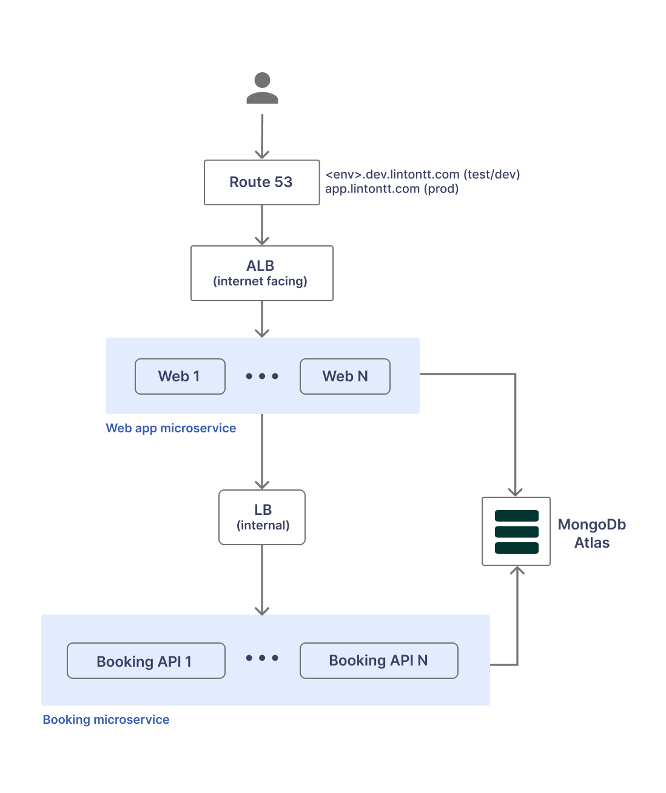
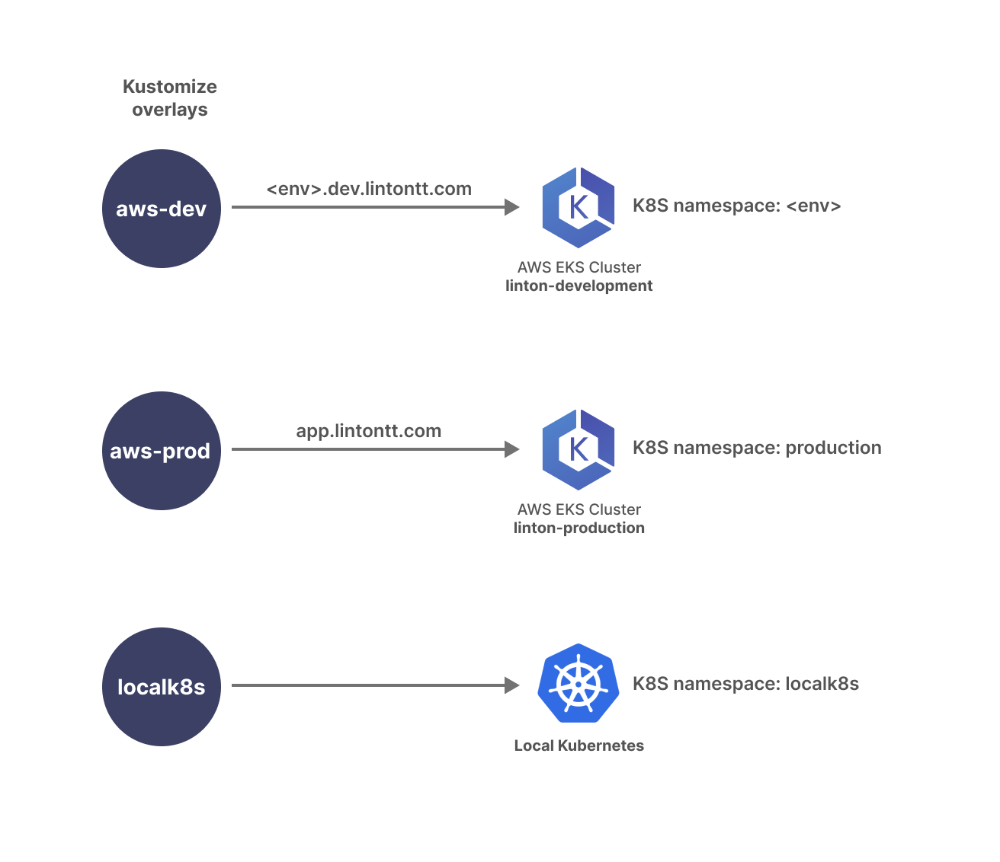

# Microservices with Micronaut and Kubernetes


This project is a learning exercise and a deeper dive into the practicalities of
developing and operating Kubernetes microservices with [Micronaut](https://micronaut.io/) and [Kotlin](https://kotlinlang.org/) on AWS.

The system is built as a learning tool and a testbed for various microservices concepts.
It's **not** a production-ready design, and it's a constantly evolving work. Contributions are welcome.

The app is a very simple hotel booking website for the fictional [Linton Travel Tavern](https://www.kost.co.uk/linton_travel_tavern/index.htm)
where Alan Partridge spent 182 days in 1996. Its location is equidistant between Norwich and London.

There are two application roles, `GUEST` and `STAFF`, with different views and access levels.
A `GUEST` can manage their own bookings, while `STAFF` members can view and manage all bookings in the system.

# Architecture
The architecture is fairly basic, using two microservices (Web and Booking), and [MongoDB Atlas](https://www.mongodb.com/atlas/database)
for persistence, in order to reduce the operational complexity and cost for this exercise.



# Objectives
Some guiding principles and things we wanted to get out of this exercise.

#### Kubernetes
 * Deploy on [AWS EKS](https://aws.amazon.com/eks/)
 * Use [AWS ECR](https://aws.amazon.com/ecr/) for Docker images 
 * [Kubernetes service discovery with Micronaut](https://micronaut-projects.github.io/micronaut-kubernetes/snapshot/guide/#service-discovery)
 * Injecting Kubernetes secrets and config maps to be used by Micronaut config
 * Make use of [Kustomize](https://kubernetes.io/docs/tasks/manage-kubernetes-objects/kustomization/)
to manage Kubernetes configs

#### Architecture / NFRs
 * Use load balancers for service traffic and materialise them into AWS ALBs/ELBs
 * Use Route53 for target environments (qa.dev.lintontt.com, feature1274.dev.lintontt.com)
to provide full working platform for development and testing.
 * HTTPS for web traffic
 * Basic role-based security for platform users

#### Persistence
 * Use [MongoDB Atlas](https://www.mongodb.com/atlas/database) for persistence
 * Secure MongoDB by default

#### Scaffolding & Devops
 * Use basic shell scripts that can be re-used or easily integrated into CI/CD pipelines
 * Deployment (Kubernetes) configs should be scope-aware but environment-agnostic (more on this in the **Learnings** section)
 * Provide a basic ("good-enough") practice for not storing passwords and secrets in the code repository
 * Devops pipeline should be service agnostic. The services should be self-describing
(or "self-configuring") while the pipeline relies on naming conventions for packaging and deployment.
 * Provide tooling for creating and deleting AWS EKS clusters

#### Development
 * Design microservices with isolation in mind, and with the idea that they could be split into
    separate code repositories if necessary [Work in progress]
 * Ability to deploy the system on a local Kubernetes cluster
 * Explore the challenges around sharing a data model & concepts between services, and related (anti)patterns

#### Others
 * Focus on architecture best practice, development and devops, and less on features or system capabilities.
 * Keep things as vanilla as possible to minimise setup and use of 3rd party tooling. In the real world,
a lot of this could be done with smarter tooling, but that's not the objective here.
 * Describe solutions for some of the caveats we've found

# What we didn't prioritise
Things that are deliberately simplified or irrelevant to the above objectives.
 * There's no mature application design for the use case. The data model is simplified/denormalised in places,
security is very basic, service and component design is often naff, etc.
 * No robust MongoDB wiring. We used a very crude/vanilla approach for interacting with Mongo. Micronaut offers [more advanced alternatives](https://guides.micronaut.io/latest/micronaut-mongodb-synchronous-gradle-kotlin.html)
should you want to explore that.
 * The web application is not state of the art. The web is built with [Thymeleaf](https://www.thymeleaf.org/) templates and the CSS styling
is intentionally simplistic. UX & UI practices are often butchered.

# Learnings
<details>
  <summary><h3>Scope-aware & environment-agnostic configs</h3></summary>



We assume the application requires 3 types of environments so we provide 3 Kustomize overlays with
each microservice:
 * `aws-dev` - a development or test environment
 * `aws-prod` - the production environment
 * `localk8s` - environment running on a local (dev machine) Kubernetes

These configs are customised for the intended _scope_ but are agnostic when it comes to environment name.
For example, deploying qa.dev.lintontt.com or feature1274.dev.lintontt.com would both use the `aws-dev` overlay
(scope) since they have similar deployments scaffolding.

Then the environment name (qa, feature1274, etc) can be passed at deployment time, to enable
[domain customisation](https://github.com/cosmin-marginean/linton/blob/874c33ddaf14ea891dbefd33dd56acb80a06e3e1/linton-web/kubernetes/overlays/aws-dev/load-balancer.yaml#L28),
[MongoDB data isolation](https://github.com/cosmin-marginean/linton/blob/874c33ddaf14ea891dbefd33dd56acb80a06e3e1/linton-utils/src/main/kotlin/com/linton/bootstrap/MongoConfig.kt#L10), etc.

```shell
cd devops
./aws-dev-create.sh qa
./aws-dev-create.sh feature1274
```

This approach minimises (eliminates) configuration changes required to spin up a new environment
while allowing for safe deployment isolation.

For simplicity and speed, all `aws-dev` environments run on the same Kubernetes cluster, `linton-development`
while production (`aws-prod`) runs on its own cluster, `linton-production`. Within the `linton-development` cluster
deployments are further segregated by using different namespaces, one for each environment.
However, it should be easy to wire the devops pipeline to provision a new EKS cluster for each environment, but
it would then take a lot longer to spin up a new deployment.


</details>

<details>
  <summary><h3>Deploying an AWS ALB with Kubernetes</h3></summary>

1. Install the [AWS Load Balancer controller](https://github.com/cosmin-marginean/linton/blob/main/devops/kubernetes/aws/create-cluster.sh#L53) (see [Creating and destroying AWS EKS clusters](#creating-and-destroying-aws-eks-clusters))
2. [Configure ALB](https://github.com/cosmin-marginean/linton/blob/main/linton-web/kubernetes/overlays/aws-dev/load-balancer.yaml#L7-L25) when deploying a Kubernetes load balancer


</details>

<details>
  <summary><h3>Using Route53 with Kubernetes</h3></summary>

To use Route53 with EKS:
1. Setup an [IAM policy](https://github.com/cosmin-marginean/linton/blob/main/devops/kubernetes/aws/policies/EKS-Route53.json) to allow EKS to manage Route53 records (see [Creating and destroying AWS EKS clusters](#creating-and-destroying-aws-eks-clusters))
2. When creating the cluster, [attach the policy](https://github.com/cosmin-marginean/linton/blob/main/devops/kubernetes/aws/create-cluster.sh#L45) using `eksctl` (see [Creating and destroying AWS EKS clusters](#creating-and-destroying-aws-eks-clusters))
3. Setup [external DNS](https://github.com/cosmin-marginean/linton/blob/main/devops/kubernetes/aws/create-cluster.sh#L61) for Kubernetes (see [Creating and destroying AWS EKS clusters](#creating-and-destroying-aws-eks-clusters))
4. Simply [configure the host name](https://github.com/cosmin-marginean/linton/blob/main/linton-web/kubernetes/overlays/aws-dev/load-balancer.yaml#L28) when deploying a load balancer


</details>

<details>
  <summary><h3>Creating and destroying AWS EKS clusters</h3></summary>

#### One time setup
1. Set up ALB IAM policy with the contents of [lb_iam_policy.json](https://github.com/cosmin-marginean/linton/blob/main/devops/kubernetes/aws/policies/lb_iam_policy.json) 
```shell
aws iam create-policy \
    --policy-name AWSLoadBalancerControllerIAMPolicy \
    --policy-document file://lb_iam_policy.json
```
2. Setup Route53 policy with the contents of [eks-route53.json](https://github.com/cosmin-marginean/linton/blob/main/devops/kubernetes/aws/policies/eks-route53.json)
```shell
aws iam create-policy \
    --policy-name EKS-Route53 \
    --policy-document file://eks-route53.json
```
3. Create the EKS cluster IAM role with the contents of [cluster-trust-policy.json](https://github.com/cosmin-marginean/linton/blob/main/devops/kubernetes/aws/policies/cluster-trust-policy.json)
```shell
aws iam create-role \
  --role-name EKS-ClusterRole \
  --assume-role-policy-document file://cluster-trust-policy.json
```
4. Attach the IAM policy to the role
```shell
aws iam attach-role-policy \
  --policy-arn arn:aws:iam::aws:policy/AmazonEKSClusterPolicy \
  --role-name EKS-ClusterRole
```

#### Create an EKS cluster
Run [create-cluster.sh](https://github.com/cosmin-marginean/linton/blob/main/devops/kubernetes/aws/create-cluster.sh)
from in `devops/kubernetes/aws` directory:
```shell
cd devops/kubernetes/aws
./create-cluster.sh linton-development
```

#### Delete an EKS cluster
Run [delete-cluster.sh](https://github.com/cosmin-marginean/linton/blob/main/devops/kubernetes/aws/delete-cluster.sh)
from in `devops/kubernetes/aws` directory:
```shell
cd devops/kubernetes/aws
./delete-cluster.sh linton-development
```
</details>

<details>
  <summary><h3>Using envsubst to customise Kubernetes deployment</h3></summary>

 1. [Setup Kubernetes configs to use variables where required](https://github.com/cosmin-marginean/linton/blob/main/linton-web/kubernetes/base/base.yaml#L4)
 2. [Export variable to be used by envsubst](https://github.com/cosmin-marginean/linton/blob/main/devops/devops-include.sh#L88)
 3. [Run envsubst before applying Kubernetes config](https://github.com/cosmin-marginean/linton/blob/main/devops/devops-include.sh#L101)

</details>

<details>
  <summary><h3>Setting up CloudWatch Container Insights</h3></summary>

This is set up when the cluster is created: https://github.com/cosmin-marginean/linton/blob/main/devops/kubernetes/aws/create-cluster.sh#L64

</details>

<details>
  <summary><h3>Others</h3></summary>

 * [Overriding Kubernetes configs using Kustomize](https://github.com/cosmin-marginean/linton/tree/main/linton-web/kubernetes/overlays)
 * [Switching Kubernetes context automatically](https://github.com/cosmin-marginean/linton/blob/main/devops/devops-include.sh#L27)
 * [Providing AWS console access to EKS clusters](https://github.com/cosmin-marginean/linton/blob/main/devops/kubernetes/aws/create-cluster.sh#L29)
 * [Basic role-based security with Micronaut](https://github.com/cosmin-marginean/linton/blob/main/linton-web/src/main/resources/application.yml#L49-L54)
 * [Loading the Thymeleaf Layout dialect with Micronaut](https://github.com/cosmin-marginean/linton/blob/main/linton-web/src/main/kotlin/com/linton/web/ThymeleadDialectLoader.kt)
 * Managing semantic versioning with Gradle
   * [Gradle plugin setup](https://github.com/cosmin-marginean/linton/blob/main/linton-web/build.gradle#L8) (full docs [here](https://github.com/Glovo/gradle-versioning-plugin))
   * Increment patch version: `./gradlew incrementSemanticVersion --patch`
 * Using [KMongo](https://litote.org/kmongo/) codec for Kotlin data classes: https://github.com/cosmin-marginean/linton/blob/main/linton-utils/src/main/kotlin/com/linton/bootstrap/KMongoFactory.kt 

</details>


# Future work
Things we'd like to explore further.
 * CI/CD pipeline integration, ideally using something off the shelf (AWS CodePipeline, CircleCI, etc)
 * Design a service that is more resource intensive and explore memory/CPU config for it
 * Auto-scale
 * AWS WAF
 * Separate the codebase into separate repositories for a true microservices approach

# Local environment setup
Prerequisites are mostly installed using [SDKMAN](https://sdkman.io/) and [Homebrew](https://brew.sh/) where possible. 
 * JDK 17
 * [MongoDB Community Edition](https://www.mongodb.com/docs/manual/tutorial/install-mongodb-on-os-x/)
 * Docker with [Kubernetes enabled](https://docs.docker.com/desktop/kubernetes/)

Next steps are:
 * [Setting up users for your local MongoDB](devops/mongodb/README.md)
 * [Setting up secrets files for your local MongoDB](https://github.com/cosmin-marginean/linton/blob/main/devops/devops-include.sh#L16-L18)

To run the app on your local Kubernetes cluster:
```shell
cd devops
./localk8s-run.sh
```

When the system is deployed, it should be accessible at http://localhost:8081, where you should get the screen below.
Login with `alan@apacheproductions.com` for `GUEST`, or `susan@lintontt.com` for `STAFF`. Password is `Zepass123!` for all users.


# AWS Setup
To run this on AWS you'll obviously need an AWS account and a series of prerequisites. 
* [awscli](https://aws.amazon.com/cli/)
* [eksctl](https://docs.aws.amazon.com/eks/latest/userguide/eksctl.html)
* [Helm](https://helm.sh/docs/intro/install/)
* [jq](https://stedolan.github.io/jq/)

_TODO - elaborate on policies, roles etc to be bootstrapped_
